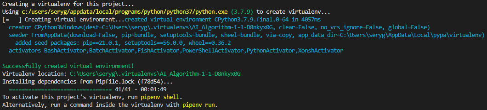
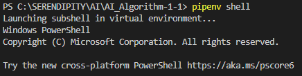
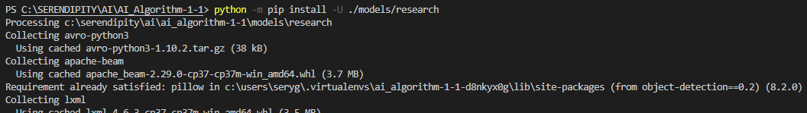
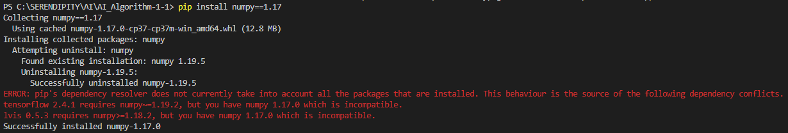

# AI_Algorithm-1

# Where's Waldo AI 
This program runs the Object Detection code to find Waldo from 10 images. 

## Contributors: Team 5
Adam Sickels, Kayla Manouchehri, Abha Naik, Sery Gunawardena, Chase Fensore

## Table of Contents:
- Repository Setup
- Requirements
- Installations
- Object Detection Program Instructions
- Image Classification Program Instructions
- Other Notes

## Repository Setup:

Clone repository by running 'git clone https://github.com/kaymano/AI_Algorithm-1' in terminal

## Requirements
- 64-bit python installation between 3.6 and 3.9, but not including 3.9
- pip
- (Microsoft C++ Build Tools)[https://visualstudio.microsoft.com/visual-cpp-build-tools/]
- Wally Model folder, download from https://drive.google.com/drive/folders/1WLSOo3tiMmjCxTzH6y_TZRW_kNHm2M2M?usp=sharing

## Installations:
1. Navigate to the AI_Algorithm-1 directory

2. Install pipenv
```bash
pip install pipenv
```

3. If you do not have 64-bit python or are running python 3.9, run
```bash
pipenv --python path/to/64-bit/python.exe install
```
where path/to/64-bit/python.exe is a path to a 64 bit installation of python between version 3 and 3.9


Otherwise, run
```bash
pipenv install
```


4. Next, start a shell with
```bash
pipenv shell
```


5. Install the object-detection library
```bash
python -m pip install -U ./models/research
```


6. Install numpy and if there is an error, ignore it. 
```bash
pip install numpy==1.17
```


If this fails, go to the [TensorFlow Object Detection API Documentation](https://tensorflow-object-detection-api-tutorial.readthedocs.io/en/latest/install.html) and [Pytorch Documentation](https://pytorch.org/get-started/locally/) and follow the installation instructions there.

## Object Detection Program Instructions

Test the model on training images
```bash
python models/research/object_detection/model_main_tf2.py --model_dir=wally_model_v6 --pipeline_config_path=wally_model_v6/pipeline.config --checkpoint_dir=wally_model_v6
```

Test the model on testing images
```bash
python models/research/object_detection/model_main_tf2.py --model_dir=wally_model_v6 --pipeline_config_path=wally_model_v6/pipeline_test.config --checkpoint_dir=wally_model_v6
```
After running these commands and the mAP appears, you can press ^C to terminate the program


## Image Classification Program Instructions
To test the image classifier, run
```bash
python image_classification.py
```
This will take about 5-10 minutes to train the model and display the accuracy

## Other Notes

- The `models` subdirectory is taken from [the tensorflow model garden github](https://github.com/tensorflow/models)
- The `wally_model_v6` subdirectory was the output from tensorflow model training
- The `image_splitting.py` file was used to split the images up into grids and should no longer be run
